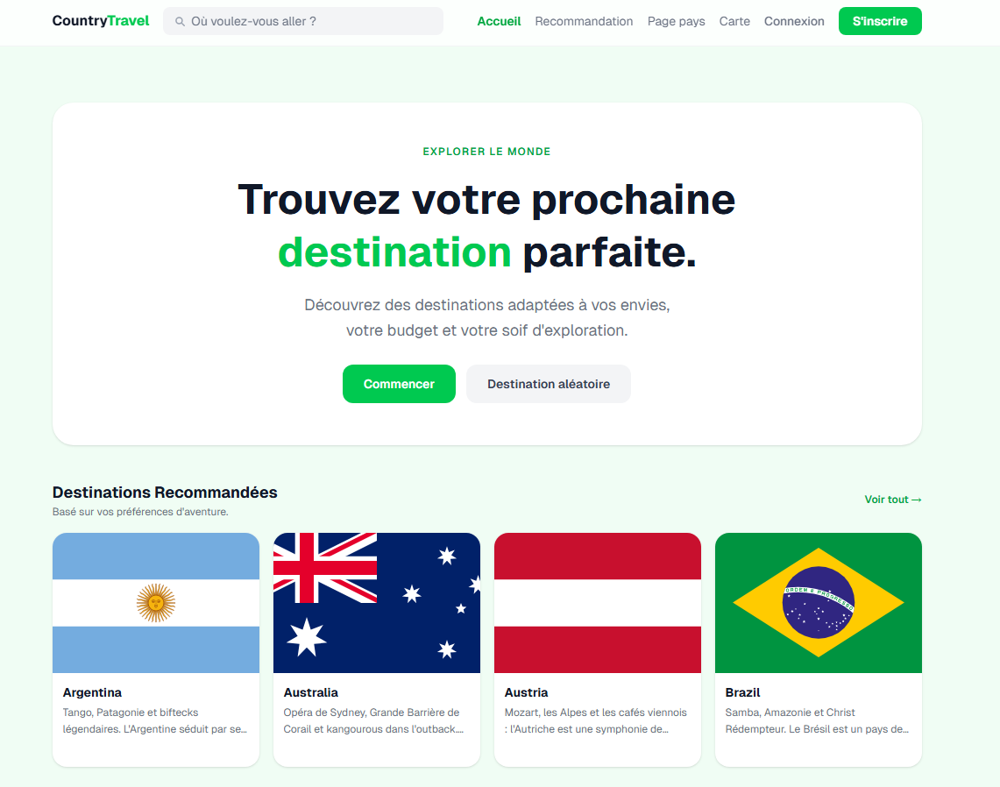

# CountryTravel

Application web d'aide au choix de destination de voyage : un moteur de recommandation
personnalisé propose un **top 5 de pays** selon les préférences du voyageur, complété par
une carte mondiale interactive, des fiches pays détaillées et un volet communautaire
(pays visités, avis notés).

Projet support de la certification **« Expert(e) en Développement Logiciel »**
(RNCP39583, Ynov Campus).



## À propos

Choisir sa prochaine destination est difficile : trop de critères (budget, sécurité,
climat, type d'expérience) et trop d'options. CountryTravel répond à un questionnaire de
préférences par un classement de destinations **scoré de 0 à 100**, transparent et
personnalisé. L'application est utilisable **sans compte** pour toute la partie
consultation et recommandation ; un compte débloque la sauvegarde et le tableau de bord.

## Fonctionnalités

- **Moteur de recommandation** — questionnaire multi-étapes → top 5 de pays scorés (filtres éliminatoires puis pondération)
- **Catalogue** de 30 pays avec fiches détaillées (budget, sécurité, climat, expériences)
- **Carte mondiale interactive** colorée selon les notes de la communauté (accessible au clavier)
- **Destination aléatoire** pour se laisser surprendre
- **Espace membre** — authentification JWT, sauvegarde des recommandations, pays visités, avis notés, tableau de bord personnel

## Stack technique

| Couche | Technologies |
| --- | --- |
| API | NestJS 11, Prisma 7, PostgreSQL |
| Front | React 18, TypeScript, Vite, Zustand, TailwindCSS |
| Qualité / Ops | Jest, Vitest, GitHub Actions (CI/CD), Railway + Netlify |

## Démarrage rapide (Docker)

### Prérequis

À installer avant de commencer :

- **[Node.js](https://nodejs.org/)** version 20 ou supérieure (vérifiez avec `node --version`)
- **[Docker Desktop](https://www.docker.com/products/docker-desktop/)** — il doit être **lancé** (icône baleine active) avant l'étape 2

Toutes les commandes ci-dessous se tapent dans un terminal, **à la racine du projet**.

### Étape 1 — Récupérer le projet

```bash
git clone https://github.com/aref400/countryTravel.git
cd countryTravel
```

### Étape 2 — Démarrer la base de données

```bash
docker compose up -d
```

Docker télécharge et démarre une base PostgreSQL en arrière-plan. Rien d'autre à installer
ni à configurer : la base est prête et jetable (`docker compose down` l'arrête).

### Étape 3 — Créer le fichier de configuration

Le projet fournit un fichier d'**exemple** nommé `.env.example`. Vous devez en faire une
**copie** et nommer cette copie **`.env`**, dans le même dossier (`apps/api/`). C'est ce
fichier `.env` qui contiendra vos réglages locaux (connexion à la base + clés de sécurité).

```bash
# macOS / Linux / Git Bash
cp apps/api/.env.example apps/api/.env

# Windows PowerShell
Copy-Item apps/api/.env.example apps/api/.env

# Windows (invite de commandes cmd)
copy apps\api\.env.example apps\api\.env
```

> Vous pouvez aussi le faire à la souris : ouvrez le dossier `apps/api`, copiez-collez le
> fichier `.env.example`, puis renommez la copie en `.env` (le nom commence bien par un point,
> et il n'y a **pas** d'extension après).

### Étape 4 — Renseigner les deux clés de sécurité

Ouvrez `apps/api/.env` dans un éditeur de texte. Deux lignes attendent une valeur :
`JWT_SECRET` et `JWT_REFRESH_SECRET`. Elles servent à signer les jetons de connexion et
doivent être **deux valeurs différentes** — l'API refuse de démarrer si l'une manque.

Lancez l'une de ces commandes **deux fois** (une valeur par ligne), et collez chaque
résultat après le `=` correspondant :

```bash
openssl rand -base64 64
# ou, si openssl est absent (fréquent sous Windows) :
node -e "console.log(require('crypto').randomBytes(48).toString('base64'))"
```

### Étape 5 — Installer les dépendances

```bash
npm install
```

### Étape 6 — Créer les tables et charger les données

```bash
npm run db:setup
```

Crée la structure de la base et y insère les 30 pays. La commande est **rejouable sans
risque** (elle met à jour au lieu de dupliquer).

### Étape 7 — Lancer l'application

```bash
npm run dev
```

L'API démarre sur le port 3000 et l'interface sur le port 5173. Laissez ce terminal ouvert.

### Vérifier que tout fonctionne

Ouvrez ces adresses dans votre navigateur :

| Adresse | Résultat attendu |
| --- | --- |
| http://localhost:5173 | Page d'accueil CountryTravel |
| http://localhost:3000/api/v1/countries | Du texte JSON (liste paginée : 20 pays affichés sur les 30 en base) |
| http://localhost:3000/api/docs | Documentation Swagger de l'API |

### En cas de problème

| Symptôme | Cause probable | Solution |
| --- | --- | --- |
| `docker: command not found` ou erreur de connexion | Docker Desktop n'est pas lancé | Démarrez Docker Desktop, attendez qu'il soit prêt, relancez l'étape 2 |
| L'API s'arrête au démarrage en parlant de `JWT_SECRET` | Une des deux clés est vide dans `.env` | Reprenez l'étape 4 (deux valeurs **différentes**, non vides) |
| Liste des pays vide | Les données n'ont pas été chargées | Relancez `npm run db:setup` |
| `port already in use` | Le port 3000 ou 5173 est déjà occupé | Fermez l'autre application, ou changez `PORT` dans `.env` |

Autres méthodes d'installation (sans Docker, ou utiliser l'application déjà déployée) :
[manuel de déploiement](docs/manuel-deploiement.md).

## Structure du dépôt

| Dossier | Contenu |
| --- | --- |
| `apps/api` | API REST — NestJS 11, Prisma 7, PostgreSQL ([README](apps/api/README.md)) |
| `apps/front` | Interface — React 18, TypeScript, Vite ([README](apps/front/README.md)) |
| `docs/` | Documentation projet (voir ci-dessous) |

## Documentation

- [Manuel de déploiement](docs/manuel-deploiement.md) — installation, environnements, CI/CD
- [Manuel d'utilisation](docs/manuel-utilisation.md) — fonctionnalités côté utilisateur
- [Manuel de mise à jour](docs/manuel-mise-a-jour.md) — dépendances, migrations, données, rollback
- [Cahier de recettes](docs/cahier-recettes.md) — 125 scénarios de tests fonctionnels
- [Plan de correction des bogues](docs/plan-correction-bogues.md) — anomalies analysées et corrigées
- [Sécurité et accessibilité](docs/securite-accessibilite.md) — mapping OWASP Top 10 et démarche RGAA
- [Critères de qualité et de performance](docs/qualite-performance.md) — outillage, seuils, portails de vérification

## Qualité

- **Tests unitaires** : Jest (API) et Vitest + React Testing Library (front)
- **Intégration continue** : lint + tests + build sur chaque pull request (`.github/workflows/pr.yml`)
- **Déploiement continu** : Railway (API) et Netlify (front) sur push `main`
