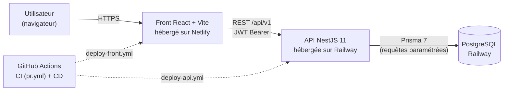

# Dossier Bloc 2 — Concevoir et développer des applications logicielles

**Certification** : Expert(e) en Développement Logiciel (RNCP39583) — Ynov Campus
**Candidat** : Lucas <!-- ✍️ TODO Lucas : nom complet, promotion, date de remise -->
**Projet support** : CountryTravel — plateforme de découverte de destinations de voyage
**Code source** : <!-- ✍️ TODO Lucas : URL du repo GitHub --> (remis avec ce dossier)

> ⚠️ **Document de travail** : les blocs `TODO Lucas` sont à compléter, les blocs `[EXTRAIT]`
> signalent du contenu à recopier/condenser depuis le document source indiqué.
> **Limite : 30 pages maximum, TOUT compris** (règlement vérifié le 17/07) — chaque élément
> figure ici en version condensée ; les documents complets restent dans `docs/` du repo,
> remis avec le code source.
>
> Budget de pages indicatif (total ≈ 29) :
> garde + sommaire 2 · §1 1,5 · §2 3 · §3 2 · §4 2 · §5 2 · §6 2 · §7 2,5 · §8 2 ·
> §9 recettes 3 · §10 bogues 2,5 · §11 versions 1,5 · §12 manuels 4,5 · conclusion 1

---

## Table de correspondance avec le référentiel

| Élément exigé par le référentiel | Section | Version complète (repo remis avec le dossier) |
|---|---|---|
| Protocole d'intégration continue | §4.1 | `.github/workflows/pr.yml` |
| Protocole de déploiement continu | §4.2 | `.github/workflows/deploy-*.yml`, `docs/manuel-deploiement.md` |
| Critères de qualité et de performance | §5 | `docs/qualite-performance.md` |
| Architecture logicielle structurée / maintenabilité | §2 | — |
| Présentation d'un prototype réalisé | §3 | — |
| Frameworks et paradigmes de développement | §2.3 | — |
| Jeu de tests unitaires sur une fonctionnalité | §6 | `apps/api/src/scoring/scoring.service.spec.ts` |
| Mesures de sécurité (OWASP Top 10) | §7 | `docs/securite-accessibilite.md` |
| Actions accessibilité + référentiel justifié (RGAA) | §8 | `docs/securite-accessibilite.md` |
| Cahier de recettes | §9 | `docs/cahier-recettes.md` |
| Plan de correction des bogues | §10 | `docs/plan-correction-bogues.md` |
| Historique des différentes versions | §11 | Historique git + PRs |
| Dernière version du logiciel fonctionnel | §1.3 | URLs de production |
| Manuel de déploiement | §12.1 | `docs/manuel-deploiement.md` |
| Manuel d'utilisation | §12.2 | `docs/manuel-utilisation.md` |
| Manuel de mise à jour | §12.3 | `docs/manuel-mise-a-jour.md` |

---

## 1. Présentation du projet

### 1.1 Le produit

CountryTravel aide un voyageur à choisir sa prochaine destination : moteur de
recommandation personnalisé (formulaire multi-étapes → top 5 de pays scorés),
destination aléatoire, carte mondiale interactive colorée par les notes de la
communauté, fiches pays détaillées, et un volet communautaire (pays visités,
avis notés, tableau de bord personnel).

<!-- ✍️ TODO Lucas : 3-4 lignes avec tes mots sur l'origine de l'idée et le public visé -->

### 1.2 Périmètre livré

Fonctionnalités en production à la date de remise :
- Authentification e-mail/mot de passe (JWT access + refresh)
- Catalogue de 30 pays avec critères de voyage (budget, sécurité, climat, 8 « niveaux » thématiques)
- Moteur de recommandation (score 0–100, filtres éliminatoires puis pondération)
- Sauvegarde des recommandations, destination aléatoire, carte mondiale interactive
- Pays visités, avis avec note (1 avis max par pays, réservé aux pays visités), tableau de bord

### 1.3 Logiciel fonctionnel en production

| | URL |
|---|---|
| Front (Netlify) | https://grand-stardust-e3ca80.netlify.app/ |
| API (Railway) | https://disciplined-art-production-4eaa.up.railway.app/api/v1 |

<!-- ✍️ TODO Lucas : 1 capture d'écran de la page d'accueil en prod -->

---

## 2. Architecture logicielle

### 2.1 Vue d'ensemble

Monorepo npm workspaces à deux applications :

- **`apps/api`** — NestJS 11 + Prisma 7 + PostgreSQL. Découpage en modules métier
  (auth, countries, recommendations, scoring, visits, reviews), chacun regroupant
  controller / service / DTOs. Documentation Swagger générée (`/api/docs`, hors production).
- **`apps/front`** — React + TypeScript + Vite. Organisation par fonctionnalité
  (`src/features/*` : auth, countries, recommendations, reviews, dashboard…),
  couche partagée (`src/shared` : client HTTP, store Zustand, composants UI).



<!-- ✍️ TODO : exporter ce schéma en image pour la version Word/PDF finale -->

### 2.2 Choix structurants pour la maintenabilité

- Séparation stricte controller (HTTP) / service (métier) / Prisma (accès données) côté API
- Validation systématique des entrées aux frontières (`class-validator` sur les DTOs, `ValidationPipe` global whitelist)
- Côté front, découpage par feature : chaque fonctionnalité embarque ses composants, hooks, services et schémas — une feature se comprend et se modifie sans toucher aux autres
- Typage TypeScript strict de bout en bout, y compris le client Prisma généré
- Base de données versionnée par migrations Prisma commitées

### 2.3 Frameworks et paradigmes

| Couche | Framework / outil | Paradigmes mis en œuvre |
|---|---|---|
| API | NestJS 11 | Injection de dépendances, modules, décorateurs, guards/pipes (AOP) |
| ORM | Prisma 7 | Schéma déclaratif, requêtes paramétrées, migrations versionnées |
| Front | React 18 + Vite | Composants fonctionnels, hooks, état immutable |
| État global | Zustand | Store minimal, sélecteurs |
| Formulaires | React Hook Form + Zod | Validation déclarative par schéma, typage inféré |
| Styles | TailwindCSS + shadcn/ui | Utility-first, composants accessibles |

<!-- ✍️ TODO Lucas : ajouter 2-3 lignes d'argumentaire ÉCRIT sur un choix structurant —
     le Bloc 2 est évalué sur dossier seul, sans oral : tout ce qui n'est pas écrit ici
     n'existe pas pour le jury. Bon candidat : le module auth encapsule ses propres pages
     et routes (features/auth/pages + auth.routes.tsx) alors que les autres pages vivent
     dans src/pages — choix de colocalisation assumé pour le module le plus sensible,
     harmonisation identifiée comme axe d'amélioration. Autres options : Zustand plutôt
     que Redux, découpage par feature. -->

---

## 3. Présentation d'un prototype : le moteur de recommandation

Fonctionnalité retenue : le parcours « formulaire multi-étapes → top 5 recommandé »,
cœur métier du produit (C2.2.1).

### 3.1 Parcours utilisateur

<!-- ✍️ TODO Lucas : 3-4 captures d'écran : étapes du formulaire, page de résultats,
     modale de sauvegarde, fiche pays atteinte depuis un résultat -->

### 3.2 Fonctionnement du scoring

1. **Filtres éliminatoires** : les pays incompatibles avec les critères non négociables
   (ex. sécurité minimale) sont exclus avant tout calcul.
2. **Score pondéré 0–100** : chaque critère du formulaire (budget, climat, affinités
   de voyage…) contribue au score selon sa pondération.
3. **Top 5** : les pays sont classés, les 5 premiers sont retournés avec leur score et rang.

Ce service (`ScoringService`) est volontairement **pur et injectable** (aucun accès
base de données) : c'est ce qui le rend exhaustivement testable — voir §6.

### 3.3 Ergonomie et sécurité du prototype

- Formulaire en 5 étapes avec état conservé (retour arrière sans perte de saisie)
- Utilisable sans compte (guard JWT optionnel) ; la sauvegarde exige l'authentification
- Réponse mesurée : 57 ms en local pour un calcul complet (voir §5.3)

---

## 4. Intégration et déploiement continus

### 4.1 Protocole d'intégration continue

Chaque pull request vers `main` déclenche le workflow `pr.yml` (GitHub Actions) :

1. Installation reproductible (`npm ci`, Node 20, cache npm) et génération du client Prisma
2. **Lint API** (ESLint) — échec bloquant
3. **Tests API avec couverture** (`test:cov`) — les seuils de couverture (80 % statements /
   65 % branches / 75 % fonctions / 80 % lignes) sont vérifiés par Jest : passer dessous
   fait échouer le job
4. **Build API** (compilation TypeScript stricte)
5. **Lint Front**, **tests Front** (Vitest), **build Front** (Vite)

Une PR ne peut être fusionnée que si l'ensemble passe. Le seuil de couverture est
**bloquant** : une baisse sous les seuils fait échouer la CI (voir §5.2).

### 4.2 Protocole de déploiement continu

Tout merge sur `main` déclenche :
- `deploy-api.yml` → build et déploiement de l'API sur **Railway** (PostgreSQL managé)
- `deploy-front.yml` → build Vite et déploiement du front sur **Netlify**

Particularité documentée : les migrations de base de données ne sont **pas** appliquées
par le pipeline — procédure manuelle décrite dans le manuel de mise à jour (complet : `docs/manuel-mise-a-jour.md`),
avec l'axe d'amélioration identifié (ajout d'une étape `prisma migrate deploy`).

<!-- ✍️ TODO Lucas : 1 capture de l'onglet Actions montrant un run vert PR + deploy -->

---

## 5. Critères de qualité et de performance

Synthèse — le détail complet, les seuils et les séquences de vérification sont dans `docs/qualite-performance.md`.

### 5.1 Outils qualité

TypeScript strict, ESLint, Prettier, tests Jest (API) et Vitest + React Testing Library
(front), CI bloquante sur lint + tests, revues par pull request.

### 5.2 Couverture de tests — mesures réelles

- **API : 85 % statements / 85 % lignes / 79 % fonctions / 71 % branches**, après
  exclusion du code généré (client Prisma) et du câblage des modules. Seuils bloquants
  en CI : 80/65/75/80.
- **Front : stratégie assumée** — tests unitaires ciblés sur la couche logique
  (`shared/services` 94 %, `shared/lib` 81 %, store, hooks) ; les composants de
  présentation sont couverts par la recette manuelle (108 scénarios, `docs/cahier-recettes.md`).
  La couverture globale front (14 %) n'est volontairement pas seuillée : ce chiffre
  et cette décision sont documentés et justifiés dans `docs/qualite-performance.md`.

### 5.3 Performance — mesures réelles (local, DB Docker)

| Endpoint | Temps |
|---|---|
| `GET /countries` (liste paginée) | 10 ms |
| `GET /countries/:iso` (détail) | 8 ms |
| `GET /countries/map/all` (carte) | 6 ms |
| `POST /recommendations/compute` | 57 ms |

Bundle front : 1 294 kB brut / **412 kB gzip** — au-dessus du seuil d'alerte Vite (500 kB),
cause identifiée (react-simple-maps + world-atlas), axe d'amélioration documenté
(lazy-loading de la route `/carte`).

---

## 6. Jeu de tests unitaires : le ScoringService

Fonctionnalité couverte : le calcul de recommandation (§3), testé par
`apps/api/src/scoring/scoring.service.spec.ts` — 10 cas couvrant les filtres
éliminatoires, la pondération, les bornes du score et les cas limites.

Le service étant pur (aucune dépendance à mocker), les tests instancient le module Nest
réel et vérifient le comportement métier directement. Deux cas représentatifs :

```ts
// Filtre éliminatoire : un pays sous le niveau de sécurité exigé est exclu (score 0),
// quelle que soit la qualité de ses autres critères
it('should return 0 if safety is too low', () => {
  const result = service.calculateScore(
    makeCriteria({ safety: 2 }),
    { ...baseForm, safety: 3 },
  );
  expect(result).toBe(0);
});

// Pondération : un écart de 1 (sur 4 possibles) sur chacun des 8 niveaux d'activité
// donne 1 − 1/4 = 0,75 par niveau, soit un score global de 75/100
it('should return 75 if all activity levels are half distance apart', () => {
  const result = service.calculateScore(
    makeCriteria({ natureLevel: 4 /* …les 8 niveaux à 4 */ }),
    { ...baseForm, natureLevel: 5 /* …les 8 niveaux demandés à 5 */ },
  );
  expect(result).toBe(75);
});
```

Les autres cas couvrent les bornes (0 et 100), l'exigence « adapté aux familles »
(éliminatoire dans un sens, neutre dans l'autre), et la garantie d'un score entier.

Harnais anti-régression complet : **84 tests API** (12 fichiers de spec — dont
AuthService : doublon à l'inscription, mauvais mot de passe ; ReviewsService : upsert
et rejet 422 pays non visité) et **53 tests front** (12 fichiers — Vitest + React
Testing Library), soit **137 tests**, tous verts, exécutés à chaque PR (§4.1).

---

## 7. Mesures de sécurité (OWASP Top 10)

Synthèse du mapping complet dans `docs/securite-accessibilite.md`. Points saillants par faille :

- **A01 Contrôle d'accès** : guards JWT, vérification de propriété (403 sur les
  ressources d'autrui), décision documentée sur le champ `role` (pas encore de routes admin)
- **A02 Données sensibles** : mots de passe bcrypt (12 rounds), secrets hors repo
  (`.env` + variables Railway/Netlify), `.env.example` fourni
- **A03 Injection** : requêtes 100 % paramétrées via Prisma, validation DTO en entrée,
  **aucun filtrage de caractères** — choix argumenté (le filtrage serait de la fausse
  sécurité et affaiblirait les mots de passe, position OWASP/ANSSI)
- **A04 Conception** : rate limiting global (100 req/min/IP) + strict sur
  `/auth/login` et `/auth/register` (5/min)
- **A05 Configuration** : Helmet, CORS, Swagger désactivé en production,
  démarrage refusé si `JWT_SECRET` absent
- **A07 Authentification** : JWT courts (15 min) + refresh (7 j), politique de mot de
  passe (8 caractères min, au moins un chiffre et une majuscule — validée front **et** API)
- **A09 Journalisation** : tentatives de connexion journalisées, jamais les mots de passe
- **Dépendances (A06)** : audit npm triagé et documenté — 3 vulnérabilités modérées
  résiduelles analysées comme non exploitables (sous-commande Prisma jamais invoquée),
  décision argumentée dans `docs/securite-accessibilite.md`

---

## 8. Accessibilité

**Référentiel choisi : RGAA** (Référentiel Général d'Amélioration de l'Accessibilité) —
référentiel officiel français, adossé aux WCAG, plus adapté qu'une checklist qualité
générale type OPQUAST pour justifier des critères précis. Justification complète dans `docs/securite-accessibilite.md`.

Actions mises en œuvre (extraits — liste complète et vérifications dans `docs/securite-accessibilite.md`) :

- **Carte mondiale accessible au clavier** : ~195 formes SVG initialement 100 % souris,
  désormais focusables (`tabIndex`, `role="button"`, `aria-label`), contour de focus
  visible, tooltip au focus, activation Entrée/Espace — vérifié en conditions réelles
- Formulaires : labels liés, `aria-invalid`, `aria-describedby`, messages `role="alert"`
- Modale de sauvegarde : piège de focus, fermeture Échap, restitution du focus
- Landmarks (`<main>`), `lang="fr"`, hiérarchie de titres
- **Titre de page unique par route** (RGAA 8.5/8.6) : hook `usePageTitle`, y compris
  dynamique sur la fiche pays (« France — CountryTravel »)
- **Contrastes conformes AA** (RGAA 3.2) : 37 textes informatifs relevés de `gray-400`
  (~2,5:1) à `gray-500`/`gray-600` (≥ 4,5:1) ; seules les icônes décoratives de champs
  déjà labellisés conservent le gris clair
- 16 scénarios de recette dédiés (SEC-01..07, A11Y-01..09), tous rejoués et validés

Limite connue assumée : périmètre RGAA ciblé sur les parcours du cahier de recettes,
pas un audit exhaustif des 106 critères du référentiel.

---

## 9. Cahier de recettes

Le cahier complet — **108 scénarios** répartis en 12 sections (authentification, pays,
recommandation, sauvegarde, aléatoire, carte, navigation, sécurité, accessibilité,
visites, avis, tableau de bord) — est remis avec le code source
(`docs/cahier-recettes.md`). Le dossier en présente la méthodologie, le bilan
d'exécution et un extrait représentatif.

### 9.1 Méthodologie

Chaque scénario précise : préconditions, étapes, résultat attendu, résultat obtenu,
statut. Les scénarios API sont exécutés via requêtes réelles (curl), les scénarios
front en navigation réelle.

### 9.2 Exécution

Campagne complète rejouée le 15/07/2026 puis complétée à la livraison du sprint 4 :
la campagne a révélé de vrais défauts (BUG-06, BUG-07, BUG-08 — voir §10),
démontrant que la recette est un outil de détection, pas une formalité.

### 9.3 Extrait représentatif

| ID | Scénario | Étapes | Résultat attendu | Statut |
|---|---|---|---|---|
| AUTH-01 | Inscription réussie | Envoyer `{email, username, password}` valides | 201, réponse avec `user` + `accessToken` + `refreshToken` | ✅ |
| AUTH-21 | Mot de passe sans chiffre | Envoyer `password: "abccddcsA"` | 400, « Le mot de passe doit contenir au moins un chiffre » | ✅ |
| SEC-02 | Rate limiting sur `/auth/login` | 6 requêtes en moins d'une minute, même IP | Les 5 premières traitées, la 6ᵉ renvoie 429 Too Many Requests | ✅ |
| A11Y-01 | Navigation clavier sur la carte | `Tab` jusqu'à un pays, valider avec `Entrée` | Contour de focus visible, tooltip identique au survol, navigation vers `/pays/:code` | ✅ |

---

## 10. Plan de correction des bogues

Le plan complet — **10 fiches** (BUG-01 à BUG-10), chacune avec symptôme, analyse de
cause, correction, commit de référence et test de non-régression — est remis avec le
code source (`docs/plan-correction-bogues.md`). Le dossier en présente le processus,
un tableau de synthèse des 10 fiches et une fiche complète en exemple.

### 10.1 Processus de traitement

1. **Détection** — scénario de recette en échec, retour utilisateur, ou échec CI
2. **Consignation** — fiche dans le plan : contexte, observé vs attendu, gravité
   (🔴 bloquant / 🟠 majeur / 🟡 mineur)
3. **Analyse** — identification de la cause racine dans le code
4. **Correction** — branche dédiée (`fix/CT-XXX/n` ou `BUG-XX`), pull request
5. **Vérification** — rejeu du scénario de recette concerné + CI verte avant merge,
   test de non-régression ajouté quand c'est pertinent

### 10.2 Exemple de fiche

**BUG-08 — Seed inopérant : dépendance à une API externe dépréciée** (🔴 bloquant
pour toute nouvelle installation)

- **Symptôme** : sur une base vierge, le seed échouait (`TypeError: all.filter is not
  a function`) — détecté lors du test d'installation à froid du projet.
- **Cause racine** : `prisma/seed.ts` appelait l'API `restcountries.com/v3.1` au moment
  du seed ; cette version de l'API a été coupée et renvoie désormais un objet d'erreur.
  La base de production, seedée avant la coupure, masquait l'anomalie.
- **Correctif** : suppression de la dépendance réseau — données exportées vers un fichier
  versionné `prisma/data/countries.json`, seed réécrit pour le lire. Le seed est désormais
  déterministe, reproductible et hors-ligne.
- **Vérification** : `npm run db:setup` sur une base Docker vierge insère les 30 pays,
  l'application complète fonctionne sur cette base fraîche.

Cette fiche illustre l'intérêt du processus : une anomalie invisible en production,
révélée uniquement parce que le manuel de déploiement a été testé en conditions réelles.

<!-- ✍️ TODO Lucas : vérifier que les commits « à renseigner à la livraison »
     des fiches BUG-06/07/08 sont maintenant remplis -->

---

## 11. Historique des versions

Flux de travail : une branche par ticket ou bug (`CT-xxx`, `BUG-xx`), pull request,
CI verte obligatoire, merge sur `main` qui déclenche le déploiement. **110 commits,
28 pull requests** à la date de rédaction.

| Jalon | Contenu livré | PRs |
|---|---|---|
| Sprint 1 | Socle technique (NestJS, React, Prisma, CI/CD), authentification | #1–… |
| Sprint 2 | Catalogue pays, seed, moteur de scoring, fiches pays | … |
| Sprint 3 | Recommandation multi-étapes, sauvegarde, aléatoire, carte mondiale | … |
| Qualité | Tests front, sécurité/accessibilité (C2.2.3), docs, qualité/perf (C2.1.1) | #17–#23 |
| Sprint 4 | Pays visités, avis, tableau de bord | #24–#26 |
| Corrections | BUG-09, BUG-10 | #27–#28 |

<!-- ✍️ TODO Lucas : compléter les numéros de PR des premiers jalons
     (git log --oneline --merges les liste tous) -->

---

## 12. Manuels

Les trois manuels figurent ici en version condensée (~1,5 page chacun dans la version
finale) ; les versions complètes sont remises avec le code source (`docs/manuel-*.md`).

<!-- ✍️ TODO : transformer les trois résumés ci-dessous en vraies versions condensées
     des manuels (commandes essentielles incluses), pas de simples descriptions -->

### 12.1 Manuel de déploiement (complet : `docs/manuel-deploiement.md`)
Trois parcours d'installation (production hébergée / local Docker recommandé / local
sans Docker), variables d'environnement, build production, pipeline CI/CD, checklist
post-déploiement. **Testé par une installation à froid sur base vierge** (Docker +
`npm run db:setup`), test qui a lui-même révélé et fait corriger BUG-08.

### 12.2 Manuel d'utilisation (complet : `docs/manuel-utilisation.md`)
Parcours utilisateur complet (compte, exploration, recommandation, carte, avis),
fonctionnalités d'accessibilité, tableau de résolution des problèmes courants.

### 12.3 Manuel de mise à jour (complet : `docs/manuel-mise-a-jour.md`)
Livraison d'une modification (branche → PR → CI → merge → déploiement), politique de
mise à jour des dépendances, évolutions de schéma de base (migrations Prisma, procédure
production), retour arrière, journal des versions.

---

## Conclusion

<!-- ✍️ TODO Lucas : 10-15 lignes avec tes mots : ce que le projet démontre par rapport
     aux compétences du bloc, ce que tu ferais différemment, les évolutions prévues
     (module profil utilisateur/RGPD CT-023, OAuth, volet social) -->

---

## Documents complets remis avec le code source

Le dossier ci-dessus condense chaque élément ; les versions intégrales sont dans le
dépôt (`docs/`), remis avec le dossier :

- Cahier de recettes — `docs/cahier-recettes.md` (108 scénarios)
- Plan de correction des bogues — `docs/plan-correction-bogues.md` (10 fiches)
- Sécurité et accessibilité — `docs/securite-accessibilite.md`
- Critères de qualité et de performance — `docs/qualite-performance.md`
- Manuels de déploiement / utilisation / mise à jour — `docs/manuel-*.md`
