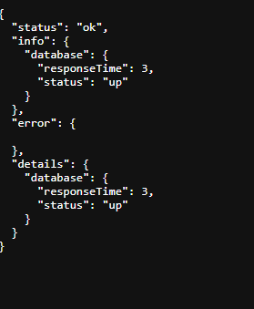
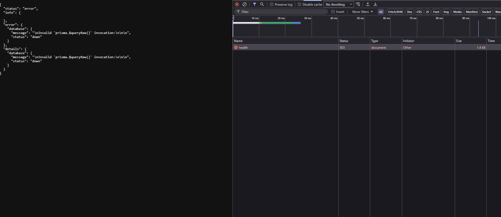
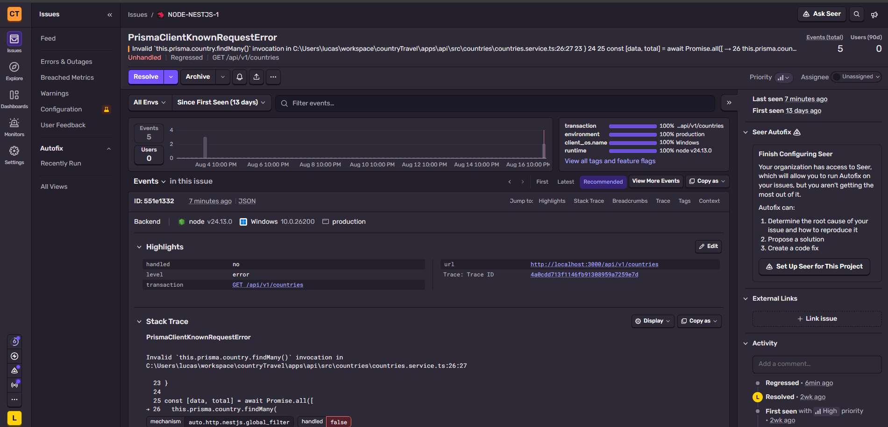
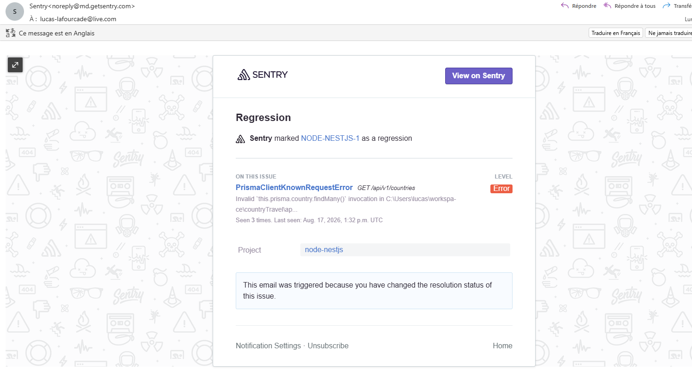
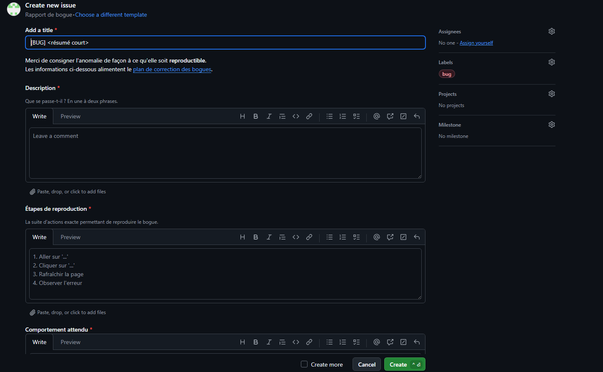

# Dossier Bloc 4 — Maintenir l'application logicielle en condition opérationnelle

**Projet : CountryTravel** — application web d'aide au choix d'une destination de voyage (moteur de recommandation par critères, catalogue de pays, avis, carte mondiale).

Ce dossier présente la gestion du **monitoring**, du **traitement des anomalies** et de la **maintenance** de CountryTravel, application développée et déployée en production au cours de la formation. Il constitue un **document autonome** : les procédures, extraits de code, réponses des sondes et exemplaire du journal nécessaires à l'évaluation sont reproduits directement dans les sections qui suivent. Le code source complet et la documentation détaillée résident dans le dépôt Git du projet (non joints au présent dossier).

## Table de correspondance avec le référentiel

| Élément attendu du livrable | Compétence | Éliminatoire | Section |
| --- | --- | :---: | --- |
| Processus de mise à jour des dépendances | C4.1.1 | | §2 |
| Système de supervision | C4.1.2 | 🔴 | §3 |
| Processus de collecte et de consignation des anomalies | C4.2.1 | 🔴 | §4.1 |
| Fiche de consignation d'une anomalie | C4.2.1 | 🔴 | §4.2 |
| Traitement d'une anomalie détectée | C4.2.2 | | §4.3 |
| Recommandations argumentées d'amélioration | C4.3.1 | | §5.1 |
| Journal de version | C4.3.2 | 🔴 | §5.2 |
| Problème résolu en collaboration avec le support client | C4.3.3 | | §5.3 |

---

## 1. Contexte d'exploitation

CountryTravel est déployée en continu sur trois composants, cibles de la maintenance en condition opérationnelle :

| Composant | Technologie | Hébergement |
| --- | --- | --- |
| API REST | NestJS 11 + Prisma | Railway |
| Base de données | PostgreSQL | Railway |
| Front (SPA) | React 19 + Vite | Netlify |

Toute livraison passe par une **pull request vers `main`**, validée automatiquement par la CI (lint, tests, build des deux applications), puis déployée automatiquement à la fusion. Ce socle d'intégration et de déploiement continus, décrit au §4.3, est le pivot de la maintenance : correctifs et évolutions empruntent le même chemin outillé.

---

## 2. Processus de mise à jour des dépendances (C4.1.1)

La maintenance des dépendances suit un processus périodique et contrôlé, décrit ci-dessous.

**Fréquence.** Revue mensuelle des dépendances, et **immédiate** en cas d'alerte de sécurité (`npm audit`).

**Périmètre logiciel concerné.** Les deux espaces de travail du monorepo : `apps/api` (NestJS, Prisma, Passport…) et `apps/front` (React, Vite, librairie de cartographie…), ainsi que les actions GitHub des workflows CI/CD.

**Type de mise à jour : manuel et contrôlé.** Le choix est assumé de ne pas automatiser les montées de version, afin de maîtriser les impacts :

```bash
npm audit                 # état des vulnérabilités connues
npm audit fix             # corrections sans changement de version majeure
npm outdated              # dépendances en retard (informationnel)
```

**Règles d'intégration sécurisée :**

- Jamais de `npm audit fix --force` sans analyse préalable (exploitabilité réelle, chemin de dépendance) : une montée majeure automatique peut casser l'application.
- Après toute mise à jour : `npx tsc --noEmit` puis suite de tests complète avant commit.
- Les montées de version **majeures** (NestJS, Prisma, React, Vite) se font isolément, une à la fois, dans une PR dédiée, où la CI valide l'absence de régression.

**Exemple réellement traité.** Une vulnérabilité critique remontée par `npm audit` sur une dépendance transitive a été corrigée de façon ciblée (version 0.4.0 du journal des versions, cf. §5.2), sans montée de version majeure, après vérification de la suite de tests.

---

## 3. Système de supervision (C4.1.2) 🔴

Le dispositif de supervision décrit ci-dessous vise à **garantir la disponibilité permanente** du logiciel en détectant au plus tôt toute indisponibilité ou dégradation.

### 3.1 Périmètre et sondes

Quatre sondes couvrent les trois composants :

| Sonde | Nature | Finalité |
| --- | --- | --- |
| Liveness `GET /api/v1/health/live` | Endpoint applicatif | Le process API répond-il ? |
| Readiness `GET /api/v1/health` | Endpoint applicatif (Terminus) | L'API peut-elle servir ? Teste la base (`SELECT 1`) et mesure sa latence |
| Sentry | SDK API + front | Capture des erreurs applicatives non gérées |
| Moniteur d'uptime | Service externe | Disponibilité perçue de l'extérieur + alerte |

Les endpoints de santé sont implémentés côté API avec la librairie `@nestjs/terminus` (module `apps/api/src/health/` du projet). Chaque indicateur Terminus constitue une sonde : ici la connexion PostgreSQL, dont la sonde renvoie le statut **et** le temps de réponse. Cœur de la sonde de readiness :

```ts
async isHealthy(key: string) {
  const indicator = this.healthIndicatorService.check(key);
  try {
    const start = Date.now();
    await this.prisma.$queryRaw`SELECT 1`;          // requête triviale, sans effet de bord
    return indicator.up({ responseTime: Date.now() - start });
  } catch (error) {
    return indicator.down({ message: (error as Error).message });
  }
}
```

Réponse de la readiness lorsque la base est disponible (HTTP 200) :

```json
{
  "status": "ok",
  "info": { "database": { "status": "up", "responseTime": 12 } },
  "details": { "database": { "status": "up", "responseTime": 12 } }
}
```

Lorsque la base est injoignable, la sonde renvoie **HTTP 503** avec `status: "down"` : le moniteur externe le détecte et déclenche l'alerte.





### 3.2 Indicateurs de suivi

Disponibilité (uptime %), temps de réponse de la readiness (ms), statut de la base (up/down), nombre et taux d'erreurs runtime (Sentry), uptime du process (s). Ces indicateurs sont adaptés à la typologie du logiciel — une application web à trafic modéré dont la disponibilité dépend de la base.

Ils constituent les **critères de qualité et de performance** suivis en exploitation : la disponibilité et le temps de réponse prolongent en production les critères de performance vérifiés lors du développement, et le taux d'erreurs mesure la fiabilité perçue par l'utilisateur. Les seuils associés à ces critères sont fixés au §3.3.

### 3.3 Seuils d'alerte

| Condition | Niveau | Action |
| --- | --- | --- |
| `/health` ≠ 200 sur 2 vérifications consécutives | 🔴 Critique | Alerte immédiate (indisponibilité) |
| Temps de réponse readiness > 2000 ms | 🟠 Alerte | Notification |
| Temps de réponse readiness > 500 ms (sur la durée) | 🟡 Vigilance | Surveillance (dégradation) |
| Nouvelle erreur remontée par Sentry | 🟠 Alerte | Notification e-mail |
| Disponibilité mensuelle < 99 % | 🟠 Alerte | Analyse a posteriori |

Avec un intervalle de vérification de 5 minutes, la règle « 2 vérifications consécutives » déclenche l'alerte en ~10 minutes : elle évite les faux positifs d'un incident réseau transitoire tout en garantissant une détection rapide.

### 3.4 Modalité de signalement

Le moniteur d'uptime notifie par **e-mail** à l'ouverture et à la résolution d'un incident ; Sentry notifie par e-mail sur nouvelle erreur, avec la stack trace et le contexte de diagnostic. L'activation de Sentry est conditionnée à une variable d'environnement (`SENTRY_DSN` côté API, `VITE_SENTRY_DSN` côté front) : sans elle, le SDK est un no-op, sans impact sur l'application.





---

## 4. Traitement des anomalies en production (C4.2)

### 4.1 Processus de collecte et de consignation (C4.2.1) 🔴

Le processus de traitement des anomalies, structuré et adapté à la typologie du logiciel, comporte cinq étapes :

1. **Détection** — scénario du cahier de recettes en échec, retour utilisateur, signalement de la supervision (Sentry, moniteur d'uptime) ou échec de la CI.
2. **Consignation** — ouverture d'une **issue GitHub** via un gabarit de rapport de bogue standardisé, qui impose les informations nécessaires à la **reproduction** : description, étapes de reproduction, comportement attendu vs observé, gravité, périmètre, environnement, source de détection. L'anomalie confirmée est reportée en fiche dans un registre consolidé des bogues du projet.
3. **Analyse** — identification de la cause racine dans le code.
4. **Correction** — développement sur une branche dédiée (`fix/…`).
5. **Vérification** — rejeu du scénario de recette concerné + revue de la CI avant fusion.

L'issue GitHub est l'**outil de collecte** : elle garantit qu'aucune information indispensable à la reproduction n'est omise à la saisie.



### 4.2 Fiche de consignation d'une anomalie (C4.2.1) 🔴

Fiche d'une anomalie réellement rencontrée (référencée BUG-02), consignée au format du gabarit :

| Champ | Valeur |
| --- | --- |
| Titre | Perte de session après rechargement de la page |
| Gravité | 🟠 Majeur |
| Périmètre | Front (React) — authentification |
| Source | Scénario de recette AUTH-18 |
| Environnement | Chrome / Windows 11 — application déployée (Netlify) |

**Étapes de reproduction :** se connecter avec des identifiants valides → constater l'accès à l'espace authentifié → rafraîchir la page (F5) → observer le retour à l'état non connecté.

**Comportement attendu :** la session est conservée après rafraîchissement tant que le token est valide.
**Comportement observé :** déconnexion silencieuse à chaque rechargement.

**Analyse (cause racine) :** `setAuth` (`apps/front/src/shared/store/auth.store.ts`) mettait à jour l'état Zustand (`user`, `accessToken`) mais n'écrivait jamais le token dans `localStorage` — seul `logout` y touchait. Le token n'était donc jamais présent pour être relu à l'initialisation de l'application.

**Préconisation de correction :** persister le token dans `localStorage` au moment de `setAuth` (avant la mise à jour du state), afin qu'il soit réhydraté au démarrage de l'application.

Ces éléments — reproduction déterministe, analyse de la cause racine et préconisation — réunissent les informations nécessaires pour corriger l'anomalie. Le correctif effectivement mis en place et déployé est présenté au §4.3.

### 4.3 Traitement d'une anomalie via l'intégration/déploiement continu (C4.2.2)

On reprend l'anomalie BUG-02 consignée au §4.2 (où figurent l'analyse de la cause racine et la préconisation) pour illustrer le traitement de bout en bout, qui **tire profit du processus d'intégration et de déploiement continu**.

**Correctif mis en place.** `setAuth` écrit désormais explicitement le token dans `localStorage` avant de mettre à jour le state, ce qui permet sa réhydratation au démarrage et résout la perte de session.

**Cheminement dans la chaîne CI/CD :**

1. Correction développée sur une branche dédiée `fix/…`.
2. Ouverture d'une **pull request vers `main`** : le workflow d'intégration continue (`pr.yml`) exécute automatiquement lint, tests et build des deux applications. La PR n'est fusionnable que si tout est vert — garde-fou contre l'introduction d'une régression par le correctif lui-même.
3. Vérification fonctionnelle : rejeu du scénario AUTH-18 (connexion puis F5 → l'utilisateur reste authentifié).
4. Fusion sur `main` → déclenchement automatique du workflow de déploiement continu (`deploy-front.yml`, Netlify).
5. En cas de problème détecté après coup, le retour arrière s'effectue par « Publish deploy » sur le déploiement antérieur (Netlify) ou `git revert`, sans interruption de service.

Le correctif, décrit ci-dessus et tracé dans l'historique Git (commit dédié), **résout l'anomalie** tout en s'appuyant sur le pipeline pour garantir la non-régression.

---

## 5. Maintenance du logiciel (C4.3)

### 5.1 Recommandations argumentées d'amélioration (C4.3.1)

Ces axes découlent des limites connues du projet et des indicateurs de supervision. Chacun est argumenté en termes de gain, de coût de mise en œuvre et de délai — ils sont réalistes et réalisables au regard du projet.

| Recommandation | Gain attendu | Coût / délai |
| --- | --- | --- |
| **Chargement différé de la page `/carte`** (`React.lazy` + `Suspense`) pour sortir la librairie de cartographie du bundle initial | Réduction sensible du poids du bundle initial (actuellement > 1,2 Mo) → temps de premier affichage plus court sur **toutes** les autres pages | Faible — quelques heures, une PR ciblée |
| **Automatiser les migrations Prisma dans `deploy-api.yml`** (`prisma migrate deploy`) | Supprime l'unique étape manuelle post-déploiement (source d'erreur et d'oubli) → déploiements plus fiables | Faible — modification d'un workflow existant |
| **Seuil de couverture ciblé sur la logique métier du front en CI** | Prévention des régressions sur la couche à plus fort risque | Faible — configuration Vitest |
| **Page de statut publique + historique d'uptime** (via le moniteur) | Transparence sur la disponibilité, preuve de suivi, communication en cas d'incident | Très faible — activation d'une option du moniteur |
| **Test de charge** (montée en concurrence) | Valider la tenue sous charge réelle, dimensionner l'hébergement | Moyen — mise en place d'un scénario de charge |

Priorisation proposée : le chargement différé de `/carte` (meilleur rapport gain/coût, améliore l'expérience de tous les utilisateurs) puis l'automatisation des migrations (fiabilise l'exploitation).

### 5.2 Journal des versions (C4.3.2) 🔴

Les évolutions sont consignées dans un journal des versions (`CHANGELOG.md`, format _Keep a Changelog_, versionnage SemVer). Chaque version datée détaille les **améliorations apportées** : nouvelles fonctionnalités (rubrique _Ajouté_), correctifs rattachés aux fiches de bogues (_Corrigé_) et corrections de sécurité (_Sécurité_). Exemplaire du journal :

> **[Non publié]** — _Ajouté :_ supervision (endpoints `/health` liveness + readiness, intégration Sentry), gabarit de consignation des anomalies, journal des versions.
>
> **[0.4.0] — 2026-07-24** — _Corrigé :_ BUG-11 (validation du secret de refresh au démarrage). _Sécurité :_ correction d'une vulnérabilité critique remontée par `npm audit`. _Documentation :_ dossier Bloc 2, manuels, qualité et sécurité.
>
> **[0.3.0] — 2026-07-17** — _Ajouté :_ carte mondiale interactive (CT-018), module « pays visités » (CT-019), module « avis » (CT-020), page de profil (CT-021), pipeline de tests en CI. _Corrigé :_ BUG-05 à BUG-10 (dont échec de build CI, page blanche sur URL inconnue, expiration de session silencieuse).
>
> **[0.2.0] — 2026-05-14** — _Ajouté :_ catalogue et détail des pays (CT-013), moteur de recommandation et tirage aléatoire (CT-014), gestion des recommandations sauvegardées (CT-015 à CT-017). _Corrigé :_ BUG-01 à BUG-04 (crash sur cache invalide, perte de session, retour arrière, 404 sur liens directs).
>
> **[0.1.0] — 2026-04-23** — _Ajouté :_ socle NestJS + React/Vite + Prisma, intégration et déploiement continus (Railway, Netlify), authentification (CT-05, CT-07), seed des pays et critères (CT-08, CT-09), API pays et moteur de score (CT-010, CT-011), page d'accueil (CT-012).

Le journal documente ainsi les correctifs déployés et retrace, version par version, l'ensemble des évolutions du logiciel.

### 5.3 Problème résolu en collaboration avec le support client (C4.3.3)

**Contexte du retour.** Lors d'une **campagne de tests utilisateurs**, un testeur a signalé une difficulté d'usage sur la sauvegarde d'une recommandation (BUG-09) : après avoir validé l'enregistrement, il ne savait pas si l'action avait réussi — la fenêtre se fermait sans aucun message, impossible de distinguer un succès d'une annulation. Le problème à résoudre était donc un **défaut d'ergonomie** générant de l'incertitude et des sauvegardes répétées.

**Contribution des différentes parties prenantes.**
- Le **testeur (utilisateur)** a remonté le ressenti et le contexte précis d'usage, permettant de qualifier le problème comme un manque de retour d'action plutôt qu'un dysfonctionnement technique.
- Le **développeur** a analysé le comportement, reproduit le cas et identifié trois défauts secondaires associés (message d'erreur persistant d'un essai précédent, bouton actif pendant la requête, libellé de debug résiduel).
- La consignation puis la vérification se sont appuyées sur le **cahier de recettes** (scénarios SAV-10, SAV-12) comme référentiel partagé entre le rôle de test et le rôle de développement.

**Résolution apportée.** Remplacement des indicateurs épars par une **machine à états explicite** (`inactive → saving → success | error`) pilotant la fenêtre de sauvegarde : message de confirmation en cas de succès (avec lien vers le tableau de bord), message d'erreur avec bouton « Réessayer » en cas d'échec, bouton désactivé pendant la requête, réinitialisation de l'état à chaque ouverture. Cinq tests unitaires couvrant les quatre états ont été ajoutés pour prévenir toute régression.

**Résultat.** Le retour d'action est désormais sans ambiguïté ; le rejeu des scénarios de recette confirme la résolution. L'échange a par ailleurs mis en évidence, dans la foulée, l'anomalie d'expiration de session silencieuse (BUG-10), traitée à son tour — illustration de la valeur du retour utilisateur dans l'amélioration continue du logiciel.

---

## 6. Synthèse

La maintenance en condition opérationnelle de CountryTravel repose sur un dispositif cohérent : une **supervision** multi-sondes (santé applicative, base, erreurs, disponibilité externe) avec seuils et signalement ; un **processus de traitement des anomalies** outillé (issues GitHub, registre consolidé) adossé à la chaîne d'intégration et de déploiement continus ; et une **maintenance évolutive** tracée par un journal de versions et nourrie par les retours utilisateurs. Les axes d'amélioration identifiés, priorisés par rapport gain/coût, en assurent la poursuite.

### Localisation des éléments dans le dépôt du projet

Le présent dossier est autonome. Pour information, les éléments techniques correspondants résident dans le dépôt Git du projet (non joint au dossier) :

- Sondes de santé : `apps/api/src/health/` — Supervision détaillée : `docs/supervision.md`
- Processus et registre des anomalies : `docs/plan-correction-bogues.md` — Gabarit de collecte : `.github/ISSUE_TEMPLATE/bug_report.yml`
- Journal des versions complet : `CHANGELOG.md`
- Mise à jour et exploitation : `docs/manuel-mise-a-jour.md`, `docs/qualite-performance.md`
- Intégration / déploiement continus : `.github/workflows/`
